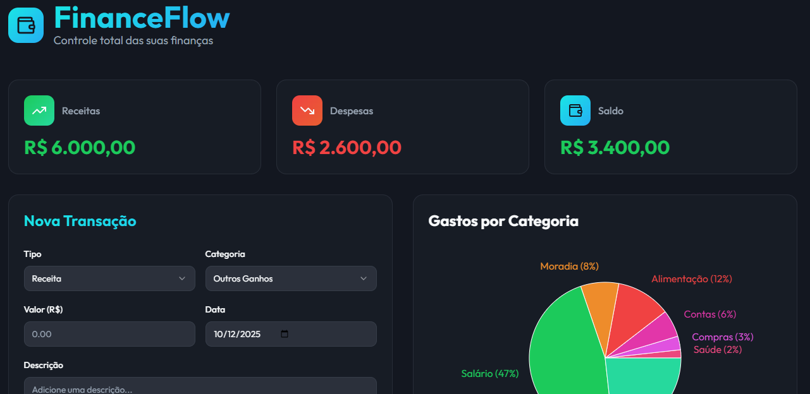

# FinanceFlow - Controle Financeiro Pessoal

## Informações do projeto
Dashboard completo para gerenciar suas finanças pessoais com gráficos, metas, categorias, histórico detalhado e opçao de fazer o download do relatorio em pdf ou csv.

**URL**: https://matheuscorreiadev.github.io/Finance-Flow/

## 📸 Vizualização

- **PrintScreen**  
  

- **Screen Recording**  
  

## Tecnologias utilizadas neste projeto

Este projeto foi construído com:

- Vite
- TypeScript
- React
- shadcn-ui
- Tailwind CSS
- Google Fonts